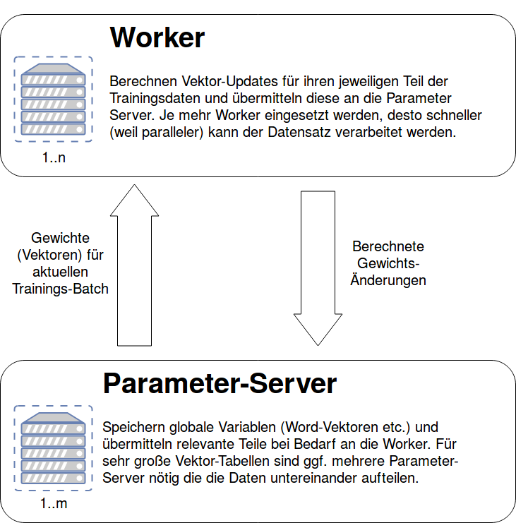

# Architektur - FastText on distributed TensorFlow

## FastText

In dem hier vorliegenden Abschnitt soll die Herangehensweise zur Implementieren des FastText Algorithmus mit Tensorflow 
beschrieben werden. Bei FastText handelt es sich um eine Erweiterung der bereits bekannten Worteinbettung word2vec. 
Jedoch ist word2vec aufgrund des Ignorierens der Wortstruktur ungeeignet für Begriffs- und vokabelreiche Sprachen. 
Sodass FastText die Darstellung eines Wortes nur mit einem Vektor durch die Summe mehrerer n-gram Vektoren ersetzt. 
Dadurch ist es möglich die Ähnlichkeiten auch von unbekannten Wörten zu bestimmen. 

#### Algorithmus:

1) Zu Beginn wird ein Ziel-Wort und die dazugehörigen positiven Kontext-Worte aus dem Trainingskorpus ermittelt. Des Weiteren nimmt man eine zufällige Anzahl 
von _N_ negativen Kontext-Wörtern. Dieses Prozedere wird als negative sampling bezeichnet und dient der Vermeidung, alle Gewichte beim Forwärtspropagieren anpassen müssen.
2) Das Ziel-Wort wird anschließend in n-gramme zerlegt, d.h. bei einer Definition _n_ = 3 entspricht das Wort laufen dem Bündel
<la, lau, auf, ufe, fen, en>.
3) Die einzelnen n-gramme werden über ein Hashverfahren in Zahlen umgewandelt und mithilfe des mod Operators 
zu einem Indize transformiert. Dieses Vorgehen ist aufgrund des großen Speicherbedarfs der n-gram-Matrix sehr empfehlenswert. Im original Dokument [1] wird das Hashverfahren FNV-1a verwendet, in dieser Arbeit jedoch sollen
verschiedene Hashverfahren ausprobiert werden. Ein Indize repräsentiert eine Zeile der n-gram-Matrix. Bei dieser Matrix handelt es 
sich um die gewünschte Worteinbettung, welche man trainiert haben möchte.
3) Das Vorwärtspropagieren des Wortes besteht aus: 
   1) Summieren der Einträge der n-gram Matrix, welche durch die Hashwerte mod _K_ indiziert werden.
   _K_ ist die vordefinierte Größe der n-gram-Matrix.
   2) Bildung des Skalarproduktes zwischen den einzelnen Kontext-Wörtern und der n-gram-Summe.
   Die Kontext-Wörter werden equivalent dem word2vec Model als eine Wortmatrix repräsentiert.
   3) Im letzen Schritt ist die Verlustfunktion über das Gradientenverfahren zu minimieren und somit die "Gewichte" der n-gram Matrix anzupassen.
   Die Verlustfunktion entspricht dabei der negativen Log-Likelihood-Funktion.

#### Implementierung

Als Implementierungsvorlage dient das skip-gram Beispiel [2]. Dabei wird die Vorlage modularisiert und einige 
Veränderung an dem TensorFlow-Graphen vorgenommen. So entsprechen die Eingabewerte den Tensor-Placeholder und die n-gram/ 
Kontext-Wort Matrix den Tensor-Variablen. Die Tensor-Variablen stellen veränderliche Bestandteile des Graphen dar und 
werden als Kanten aufgefasst. Wie bereits erwähnt dient als Verlustfunktion die negative Log-Likelihood-Funktion in Kombination 
mit dem negative Sampling. Das Gradientenverfahren wird über die Klasse GradientDescentOptimizer realisiert. Sowohl die Verlustfunktion als auch
das Gradientenverfahren stellen in dem Tensorflow-Graphen die Operationen (Knoten) dar. Hyperparameter wie Lernrate, Featuregröße (Anzahl Neuronen/Spalten der Matrizen), n-gram Matrixgröße (_K_ Zeilen), Batchgröße, Anzahl der Kontext-Wörter , Anzahl der n-gramme, ...,
sollen beim Aufruf des Programs durch den Benutzer einstellbar sein. 

## Distribution

Für die Verteilung der Berechnung der Word-Vektoren auf mehrere Rechner, wird der in TensorFlow vorgesehene Mechanismus genutzt. Dabei werden die zur Verfügung stehenden Server aufgeteilt in Parameter-Server und Worker.  
- Die Parameter-Server speichern die Variablen des TensorFlow-Graphen. Braucht ein Worker für die aktuelle Berechnung den Wert einer Variable so wird dieser vom betreffenden Parameter-Server an den Worker übermittelt. Da bei einer sehr großen Menge von Variablen Speicher oder Netzwer-IO eines einzelnen Parameter-Servers eventuell nicht mehr ausreichen ist es auch möglich die Variablen unter mehreren Parameter Serven aufzuteilen. Für große Trainingsdatensätze und hohe Embedding-Dimensionen dürfte das auch in unserem Fall nötig sein. 
- Die Worker führen die eigentlichen Berechnungen durch, in unserem Fall also die Berechnung von Word-Vektoren aus Trainingsdaten. Jeder Worker operiert dabei auf einem Teil der Trainingsdaten. Bestimmte Daten, wie das Mapping Wort->int oder die Worthäufigkeiten in den Trainingsdaten müssen allerdings auf allen Workern vorliegen. Dies kann entweder über die seperate Berechnung auf jedem Worker oder die einmalige Berechnung und anschließende Verteilung über die Parameter-Server erfolgen. Welche der beiden Varianten performanter ist wird sich zeigen.  

Die benötigten Daten-Übertragungen zwischen Workern und Parameter-Servern werden von TensorFlow automatisch in den Berechnungs-Graphen eingefügt. Von unserer Seite ist dafür keine zusätzlicher Arbeit nötig. 

Der Grobe Ablauf des Trainings sieht folgendermaßen aus:  

0. Variablen werden initialisiert. Die beteiligten Server bauen Verbindungen zueinander auf und warten bis alle Server bereit sind.
1. Jeder Worker generiert aus seinem Teil der Trainingsdaten seinen nächsten Trainings-Batch.
2. Jeder Worker holt sich vom jeweils zuständigen Parameter-Server die aktuellen Vektoren für die n-gramme der Ziel-Worte, sowie die Vektoren der passenden Kontext-Worte und die Vektoren  von einer Menge zufälliger nicht-passender Kontext-Worte
3. Jeder Worker führt das NCE-Sampling für seine aktuelle Batch durch und berechnet die vorzunehmenden Änderungen an den Vektoren.
4. Jeder Worker übermittelt die berechneten Änderungen an den Vektoren asynchron an die Parameter-Server. (Die Asynchronität der Updates könnte zu suboptimalen Verhalten führen, laut der TensorFlow-Dokumentation kommt es aber zu keinenen praktisch-relevanten Problemen)
5. Wenn das Training nicht aufgrund von der vorgegebenen Schrittzahl oder Fehlerquote beendet wurde, gehe zu Schritt 1.

Hier ein kleines Diagramm um den (zugegeben recht simplen) Aufbau zu veranschaulichen:

## Deployment

Der aktuelle Plan sieht vor führ das Deployment der verteilten Umgebung auf Docker zurückzugreifen.  
Während der Entwicklungsphase wird docker-compose genutzt um auf einem einzelnen Rechner mehrere isolierte Instanzen der Software zu starten, die mittels eines virtuellen Netzwerkes miteinander kommunizieren.  
Für das Deployment auf dem Galaxy-Cluster soll docker-swarm benutzt werden, wodurch die verschiedenen Instanzen der Software auf mehrere physische Rechner verteilt und dennoch zentral verwaltet werden können. Laut der Webseite des Uni-Rechenzentrums ist Docker auf den Nodes des Galaxy-Clusters bereits installiert.

## Quellen

[1]https://arxiv.org/pdf/1607.04606.pdf  
[2]https://github.com/tensorflow/tensorflow/tree/master/tensorflow/examples/tutorials/word2vec

