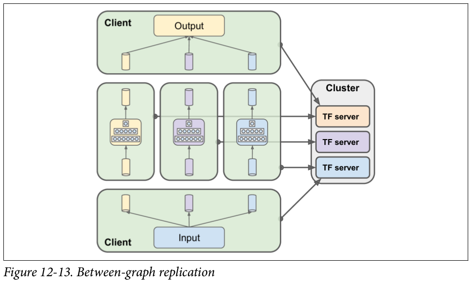

# Architektur - FastText on distributed TensorFlow

## FastText

In dem hier vorliegenden Abschnitt soll die Herangehensweise zur Implementieren des FastText Algorithmus mit Tensorflow 
beschrieben werden. Bei FastText handelt es sich um eine Erweiterung der bereits bekannten Worteinbettung word2vec. 
Jedoch ist word2vec aufgrund des Ignorierens der Wortstruktur ungeeignet für Begriffs- und vokabelreiche Sprachen. 
Daher ersetzt FastText die Darstellung eines Wortes nur mit einem Vektor durch die Summe mehrerer n-gram Vektoren. 
Dadurch ist es möglich die Ähnlichkeiten auch von unbekannten Wörten zu bestimmen. 

#### Algorithmus:

1) Zu Beginn wird ein Ziel-Wort und die dazugehörigen positiven Kontext-Worte aus dem Trainingskorpus ermittelt. Des Weiteren nimmt man eine zufällige Anzahl 
von _N_ negativen Kontext-Wörtern. Dieses Prozedere wird als negative sampling bezeichnet und dient dazu, beim Forwärtspropagieren nicht Ähnlichkeiten für alle Worte des Korpus Berechnen zu müssen und bei Rückpropagieren nur wenige Gewichte modifizieren zu müssen, wodurch die GEschwindigkeit des Trainings verbessert wird.
2) Das Ziel-Wort wird anschließend in n-gramme zerlegt, d.h. bei einer Definition _n_ = 3 entspricht das Wort laufen dem Bündel
<la, lau, auf, ufe, fen, en>.
3) Die einzelnen n-gramme werden mittels Bucket-Hashing auf eine zuvor festgelegte Anzahl an Zahlen abgebildet. Dieses Vorgehen ist aufgrund des großen Speicherbedarfs der n-gram-Matrix sehr empfehlenswert. Im Originaldokument [1] wird das Hashverfahren FNV-1a verwendet, in dieser Arbeit jedoch sollen
verschiedene Hashverfahren ausprobiert werden. Ein Indize repräsentiert eine Zeile der n-gram-Matrix. Bei dieser Matrix handelt es 
sich um die gewünschten Worteinbettungen, welche man trainiert haben möchte.
3) Das Vorwärtspropagieren des Wortes besteht aus: 
   1) Summieren der Einträge der n-gram Matrix, welche durch die Hashwerte mod _K_ indiziert werden.
   _K_ ist die vordefinierte Größe der n-gram-Matrix.
   2) Bildung des Skalarproduktes zwischen den einzelnen Kontext-Wörtern und der n-gram-Summe.
   (Die Kontext-Wörter werden equivalent dem word2vec Model als eine Wortmatrix repräsentiert.)
   3) Im letzen Schritt ist die Verlustfunktion über das Gradientenabstiegsverfahren zu minimieren und somit die "Gewichte" der n-gram Matrix anzupassen.
   Die Verlustfunktion entspricht dabei der negativen Log-Likelihood-Funktion.

#### Implementierung

Als Implementierungsvorlage dient das skip-gram Beispiel [2]. 

Datenvorverarbeitung:

1. Ein Trainingcorpus wird über den Parameter --corpus_path an das Programm übergeben. Zusätzlich können weitere Parameter
(siehe settings.py) übergeben werden. Die Defaultwerte entsprechen den Empfehlungen aus dem Paper [4]. Im Preprocessing
wird zuerst entschieden ob der Trainingkorpus mit mehr als einem Prozessor bearbeitet werden soll. Dabei orientiert sich das
Programm an der Größe ( > 100MB --> multiprocessing) des Corpusfiles. Mithilfe des NLTK-Modules wird der Text in seine
einzelnen Sätze zerlegt. Anschließend werden die Sätze bereinigt (Punktuation/Zahlen/Sonderzeichen entfernt). Das Resultat ist
eine Liste mit den Sätzen als Elemente.

2. Im zweiten Schritt wird die Häufigkeit der einzelnen Wörter ermittelt. Eine sogenannte "Drop-Probability" 
hilft im  späteren Verlauf des Algorithmus seltene Wörter zu eliminieren. Zuvor wird jedoch über die
einfache Häufigkeit ein weiterer Eliminierungprozess durchgeführt.

3. Über eine Generator-Pipeline werden die Sätze geparsd. Dabei gibt der Parameter skip_window die 
"Fensterbreite" des Targetwortes an und generiert die jeweiligen Tupel (Targetwort, Kontextwort). 
Nun kommt die Drop-Probability zum Einsatz. Dieser
Wert entscheidet darüber, ob das betrachtende Kontextwort bleibt oder nicht. Über die
Generatoren _lookup_label, _ngrammize, _hash_ngrams, erfolgen die Schritte der n-gram-Zerlegung und
des n-gram-Hashings.

4. Im letzten Teil des Preprocessings schreibt die Funktion write_batches_to_file()
die generierten Trainingstupel-Batches in ein für Tensorflow bestimmtes Format. Die
Größe der Batches kann wiederum über den Parameter batches_size angegeben werden. 

## Distribution

Für die Verteilung der Berechnung der Word-Vektoren auf mehrere Rechner, wird der in TensorFlow vorgesehene Mechanismus genutzt. Dabei werden die zur Verfügung stehenden Server aufgeteilt in Parameter-Server und Worker.  
- Die Parameter-Server speichern die Variablen des TensorFlow-Graphen. Braucht ein Worker für die aktuelle Berechnung den Wert einer Variable so wird dieser vom betreffenden Parameter-Server an den Worker übermittelt. Da bei einer sehr großen Menge von Variablen Speicher oder Netzwer-IO eines einzelnen Parameter-Servers eventuell nicht mehr ausreichen ist es auch möglich die Variablen unter mehreren Parameter Serven aufzuteilen. Für große Trainingsdatensätze und hohe Embedding-Dimensionen dürfte das auch in unserem Fall nötig sein. 
- Die Worker führen die eigentlichen Berechnungen durch, in unserem Fall also die Berechnung von Word-Vektoren aus Trainingsdaten. Jeder Worker operiert dabei auf einem Teil der Trainingsdaten. Bestimmte Daten, wie das Mapping Wort->int oder die Worthäufigkeiten in den Trainingsdaten müssen allerdings auf allen Workern vorliegen. Dies kann entweder über die seperate Berechnung auf jedem Worker oder die einmalige Berechnung und anschließende Verteilung über die Parameter-Server erfolgen. Welche der beiden Varianten performanter ist wird sich zeigen.  

Die benötigten Daten-Übertragungen zwischen Workern und Parameter-Servern werden von TensorFlow automatisch in den Berechnungs-Graphen eingefügt. Von unserer Seite ist dafür keine zusätzlicher Arbeit nötig. 

Der Grobe Ablauf des Trainings sieht folgendermaßen aus:  

0. Variablen werden initialisiert. Die beteiligten Server bauen Verbindungen zueinander auf und warten bis alle Server bereit sind.
1. Jeder Worker generiert aus seinem Teil der Trainingsdaten seinen nächsten Trainings-Batch.
2. Jeder Worker holt sich vom jeweils zuständigen Parameter-Server die aktuellen Vektoren für die n-gramme der Ziel-Worte, sowie die Vektoren der passenden Kontext-Worte und die Vektoren  von einer Menge zufälliger nicht-passender Kontext-Worte
3. Jeder Worker führt das NCE-Sampling für seine aktuelle Batch durch und berechnet die vorzunehmenden Änderungen an den Vektoren.
4. Jeder Worker übermittelt die berechneten Änderungen an den Vektoren asynchron an die Parameter-Server. (Die Asynchronität der Updates könnte zu suboptimalen Verhalten führen, laut der TensorFlow-Dokumentation kommt es aber zu keinenen praktisch-relevanten Problemen)
5. Wenn das Training nicht aufgrund von der vorgegebenen Schrittzahl oder Fehlerquote beendet wurde, gehe zu Schritt 1.

Hier ein kleines Diagramm um den (zugegeben recht simplen) Aufbau zu veranschaulichen:

## Deployment

Der aktuelle Plan sieht vor führ das Deployment der verteilten Umgebung auf Docker zurückzugreifen.  
Während der Entwicklungsphase wird docker-compose genutzt um auf einem einzelnen Rechner mehrere isolierte Instanzen der Software zu starten, die mittels eines virtuellen Netzwerkes miteinander kommunizieren.  
Für das Deployment auf dem Galaxy-Cluster soll docker-swarm benutzt werden, wodurch die verschiedenen Instanzen der Software auf mehrere physische Rechner verteilt und dennoch zentral verwaltet werden können. Laut der Webseite des Uni-Rechenzentrums ist Docker auf den Nodes des Galaxy-Clusters bereits installiert.

## Daten-Vorverarbeitung

Die Vorverarbeitung der Trainingsdaten geschieht mittels NLTK. Dabei werden beispielsweise Satzzeichen entfernt, Worte werden in ein einheitliches Format überführt und der Trainingskorpus in Inhaltlich zusammenhängende Blöcke geteilt.
Das Ergebnis der Vorverarbeitung ist eine einzelne große Text-Datei. Jede Zeile repräsentiert einen inhaltlich zusammenhängenden Block (z.B. Artikel, Absätze, Sätze o.ä.).
Eventuell wird die Berechnung einiger für den fasttext-Algorithmus nötigen Werte (z.B. Worfrequenzen) bereits in diesem Schritt ermittelt, so das dies später nicht mehr getan werden muss. Das subsampling wird nach den Empfehlungen (Formel sowie Treshold) von Mikolov u.a. [4] vorgenommen.
Das eigentliche Programm ließt diese Datei ein und generiert daraus on-the-fly Trainingsbatches aus Targetword-Contextword-Paaren für das neuronale Netzwerk.

## Details zur Verteilung

Im Folgenden wird der Ablauf des verteilten Algorithmus beschrieben.
Wir speichern die Trainingsdaten an einem Ort, die von jeder Instanz erreichbar ist. 
Auf jeden beteiligten Node wird mittels Dockerswarm eine Instanz unseres Programms gestartet.
Den Instanzen werden mittels Kommandozeilenparameter Informationen übergeben, die vom Programm mittels des
argparse Moduls verarbeitet werden.

Darunter sind: 

- die IP-Adresse und Ports der anderen Clusterteilnehmer
- ob die Instanz ein Parameterserver oder ein Worker ist
- die Nummer der Instanz unter den Workern/Parameterservern
- Hyperparameter des Modells
- Speicherort der Trainingsdaten (auf einem erreichbaren Filesystems)

Das Programm startet jeweils einen Tensorflowserver auf dem lokalen Rechner.
Die Parameterserver joinen dem Cluster und warten auf das Ende des Trainings.
Jeder Worker baut einen eigenen Graph und sendet ihn an seinen lokalen Tensorflowserver.
Die Worker warten darauf, dass die gemeinsamen Variablen initialisiert werden und alle Worker dem Cluster beigetreten 
sind. 
Anschließend berechnet jeder Worker einige Werte über den gesamten Datensatz darunter beispielsweise
Wortfrequenzen in den Trainingsdaten und ein Mapping Wort zu Zahl. Die Werten müssen über dem gesamten Datensatz berechnet 
werden, da diese auf jedem Worker identisch sein müssen.
Zu einem späteren Zeitpunkt, kann dieser Schritt verteilt ausgeführt werden z.B. mittels MapReduce.
Nun berechnet jeder Worker unabhängig von den anderen Workern für seinen Teil der Trainingsdaten Änderungen an
den gemeinsamen Gewichten und wendet diese Änderungen an.
Diese Änderungen werden durch Tensorflow transparent direkt auf den Parameterservern asynchron und ohne
Locking durchgeführt. Dieser Prozess wird weiter fortgeführt bis die Fehlerrate nicht weiter verbessert wird oder
eine festgelehnte Menge an Zeit oder Iteration verstrichen ist. Während des gesamten Trainings und am Ende des Trainings
werden periodisch die Gewichte gespeichert. 

Unsere Architektur (Worker,Parameterserver) entspricht im wesentlichen Downpour-SGD. Bei Art der 
Paralellität handelt es sich hierbei um Datenparalellität. Modellparalellität kommt nicht zum Einsatz.
Die Art der Grapherstellung (jeder Worker baut seinen eigenen Graph) wird Between-Graph Replication [3] genannt.
Der Vorteil dabei ist, dass lokal beim Worker vorhandene Trainingsdaten genutzt werden können und
nicht von einem zentralen Client aus übertragen werden müssen.

Ähnlich wie beim HOGWILD!-Algorithmus rechnen wir nicht mit Problemen durch die asynchronen und Lock-Freien Updates 
der Gewichte, da bei jedem Trainingsschritt nur ein kleiner Teil der Gewichte modifiziert wird. 
Dadurch sind konflikte durch gleichzeitige Updates verschiedener Worker eher selten und haben kaum negativen Einfluss.

[3]

## Quellen

[1]https://arxiv.org/pdf/1607.04606.pdf  
[2]https://github.com/tensorflow/tensorflow/tree/master/tensorflow/examples/tutorials/word2vec  
[3]Aurélien Géron (2017): Hands-On Machine Learning with Scikit-Learn and TensorFlow, S. 335  
[4]https://arxiv.org/pdf/1310.4546.pdf

